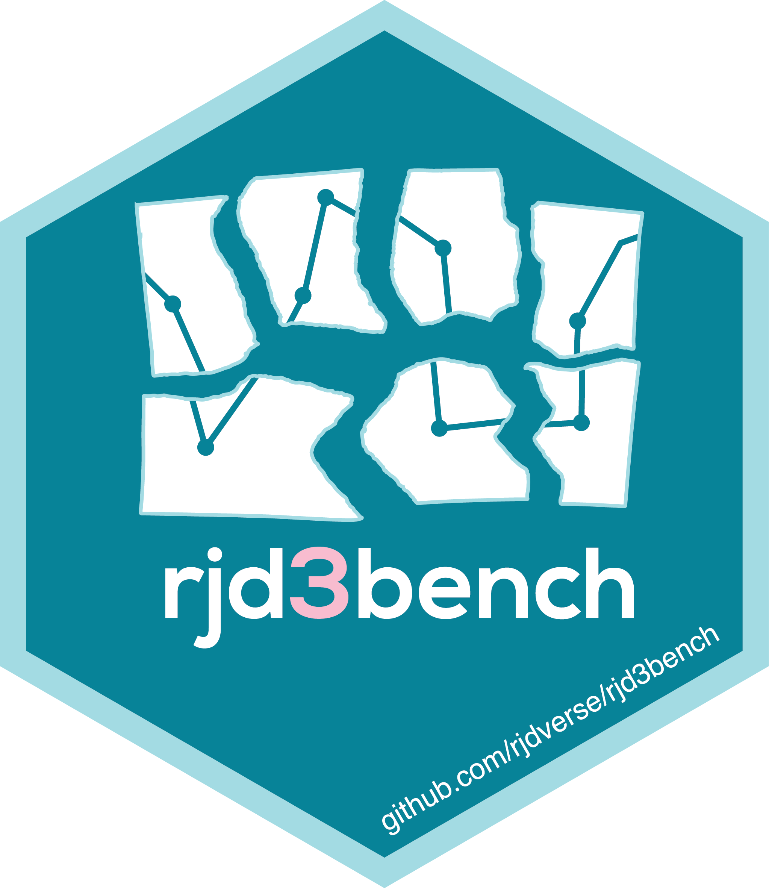

<!-- README.md is generated from README.Rmd. Please edit that file -->

# `rjd3bench` <a href="https://rjdverse.github.io/rjd3bench/"></a>

<!-- badges: start -->

[](https://CRAN.R-project.org/package=rjd3bench)
[](https://github.com/SNStatComp/awesome-official-statistics-software)

[](https://github.com/rjdverse/rjd3bench/actions/workflows/R-CMD-check.yaml)
[](https://github.com/rjdverse/rjd3bench/actions/workflows/lint.yaml)

[](https://github.com/rjdverse/rjd3bench/actions/workflows/pkgdown.yaml)
<!-- badges: end -->

## Overview

rjd3bench provides a variety of methods for temporal disaggregation &
interpolation, benchmarking, reconciliation and calendarization.

Temporal disaggregation & interpolation:

- Chow-Lin, Fernandez and Litterman
- Model-Based Denton
- Autoregressive Distributed Lag (ADL) models
- Reverse regression

Benchmarking:

- Denton
- GRP (Growth Rate Preservation)
- Cubic Splines
- Cholette

Reconciliation and multivariate temporal disaggregation:

- Multivariate Cholette

Calendarization

## Installation

Running rjd3 packages requires **Java 17 or higher**. How to set up such
a configuration in R is explained
[here](https://jdemetra-new-documentation.netlify.app/#Rconfig)

### Latest release

To get the current stable version (from the latest release):

- From GitHub:

``` r
# install.packages("remotes")
remotes::install_github("rjdverse/rjd3toolkit@*release")
remotes::install_github("rjdverse/rjd3bench@*release", build_vignettes = TRUE)
```

- From [r-universe](https://rjdverse.r-universe.dev/rjd3bench):

``` r
install.packages("rjd3bench", repos = c("https://rjdverse.r-universe.dev", "https://cloud.r-project.org"))
```

### Development version

To get the current development version from GitHub:

``` r
# install.packages("remotes")
remotes::install_github("rjdverse/rjd3bench", build_vignettes = TRUE)
```

## Package Maintenance and contributing

Any contribution is welcome and should be done through pull requests
and/or issues. pull requests should include **updated tests** and
**updated documentation**. If functionality is changed, docstrings
should be added or updated.

## Licensing

The code of this project is licensed under the [European Union Public
Licence
(EUPL)](https://interoperable-europe.ec.europa.eu:443/collection/eupl/eupl-text-eupl-12).
